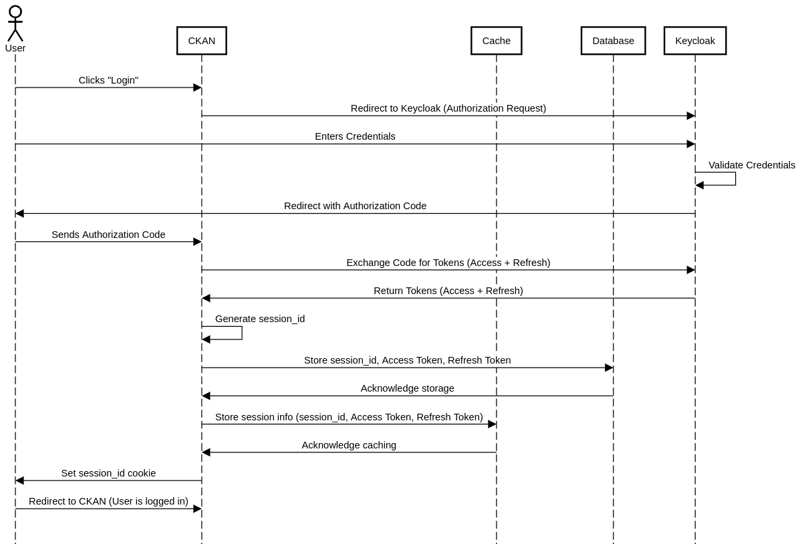
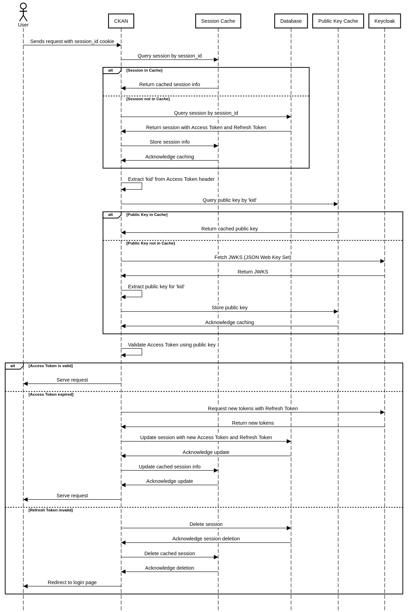
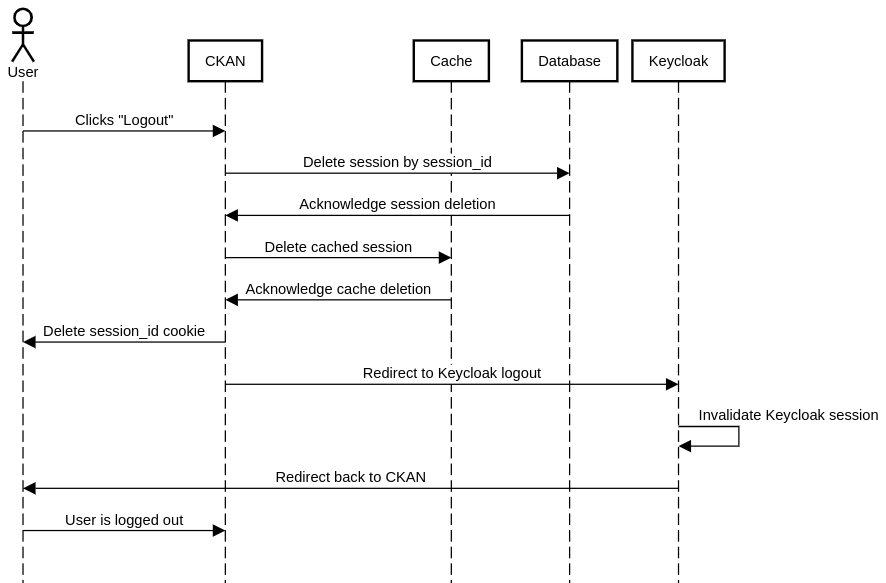

# ckanext-keycloak_auth

## Description
CKAN extension that enables Keycloak authentication and user management.

## Authentication Flow

### 1. **Login Flow**

The login process consists of a series of steps that take the user from unauthenticated to authenticated status within the system. This process leverages **OAuth2 with Keycloak as the identity provider**.

#### Login Flow Diagram:



#### Step-by-Step Login Flow:

1. **User Requests Login**:
   - In CKAN the user clicks the "Log in" button at the top of the page.
   - The user is redirected to the Keycloak login page by the CKAN system.

2. **Redirection to Keycloak**:
   - CKAN constructs a URL that points to the Keycloak authorization endpoint.
   - The URL contains the `client_id` (which identifies CKAN as the client), the `redirect_uri` (the URL Keycloak should redirect the user to after authentication), and other parameters such as `response_type=code` and `scope=openid`.
   - The user is redirected to this Keycloak URL.

3. **Keycloak Authentication**:
   - The user is presented with a login form on the Keycloak page.
   - The user enters their credentials (username and password) and submits the form.
   - Keycloak authenticates the user based on these credentials.

4. **Authorization Code Received**:
   - After successful authentication, Keycloak generates an **authorization code**.
   - The user is redirected back to CKAN at the specified `redirect_uri` (`/authenticate`) with the authorization code included in the query parameters.

5. **Token Exchange**:
   - CKAN receives the authorization code.
   - CKAN sends a server-to-server POST request to Keycloak’s token endpoint, exchanging the authorization code for an **access token** and a **refresh token**.
   - If successful, Keycloak responds with the access and refresh tokens.

6. **Session Creation**:
   - CKAN generates a secure session ID and associates it with the user.
   - The access token and refresh token are stored in the CKAN database, linked to the session ID.
   - A session cookie (`session_id`) is set in the user's browser, allowing CKAN to identify the user in subsequent requests.

7. **User Redirected to CKAN**:
   - After tokens are stored, the user is redirected to the CKAN interface, now logged in and authenticated.
   - CKAN sets the `session_id` cookie to maintain the user’s session.

---

### 2. **Identify (User Verification) Flow**

Once the user is logged in, CKAN needs to verify their identity on each request to ensure the user is authorized to access the requested resources. This is handled by inspecting the session and validating the access token.

#### Identify Flow Diagram:



#### Step-by-Step Identity Verification Flow:

1. **User Sends a Request**:
   - The user navigates the CKAN site, making various requests (e.g., visiting a dataset page).
   - CKAN checks the request for the presence of a valid `session_id` cookie.

2. **Session Lookup**:
   - CKAN retrieves the `session_id` from the user's cookies.
   - It looks up the session in the database to find the associated access token and refresh token.

3. **Access Token Validation**:
   - CKAN checks if the access token is valid and has not expired.
   - If the token is valid, CKAN decodes the JWT token to extract user information (such as email, username, and roles).
   - CKAN then identifies the user based on this information, ensuring that the request is properly authorized.

4. **Access Token Expiration Handling**:
   - If the access token has expired, CKAN attempts to use the **refresh token** to obtain a new access token from Keycloak.
   - CKAN sends a request to Keycloak’s token endpoint with the refresh token.
   - If successful, Keycloak returns a new access token and refresh token, which are stored in the session, and the user session is updated.

5. **Failed Token Validation**:
   - If CKAN cannot refresh the token or the tokens are invalid, the user is logged out and redirected to the login page.

6. **User Continuation**:
   - If the token validation succeeds, the user continues to interact with CKAN as the identified, authenticated user.

---

### 3. **Logout Flow**

When a user logs out, the system must invalidate the session both in CKAN and in Keycloak, and ensure the user is no longer able to access protected resources.

#### Logout Flow Diagram:



#### Step-by-Step Logout Flow:

1. **User Initiates Logout**:
   - The user clicks a "Logout" button in the CKAN interface.
   - CKAN triggers the logout process.

2. **Session Deletion in CKAN**:
   - CKAN deletes the user’s session from its internal session storage, effectively removing the stored access and refresh tokens.
   - CKAN clears the `session_id` cookie from the user's browser, ensuring no further session identification is possible.

3. **Redirection to Keycloak Logout**:
   - CKAN redirects the user to the Keycloak logout endpoint.
   - This ensures that the user is also logged out of Keycloak, invalidating the session in the identity provider as well.

4. **User Redirected Back to CKAN**:
   - After logging out from Keycloak, the user is redirected back to CKAN (to a predefined URL, often the homepage).
   - The user is now fully logged out and must log in again to access protected resources.

---

### Summary

- **Login**: The user is redirected to Keycloak, authenticates, and returns to CKAN with tokens that are stored in a session. The session is maintained using a `session_id` cookie.
- **User Verification (Identify)**: On each request, CKAN verifies the user by checking the session, validating the access token, and potentially refreshing it if expired.
- **Logout**: The session is destroyed in CKAN, and the user is logged out from both CKAN and Keycloak. The session cookie is removed.


## Setup

1. Install <a href="https://docs.ckan.org/en/2.9/extensions/tutorial.html#installing-ckan" target="_blank">CKAN</a>

2. Start a Keycloak instance in Docker - <a href="https://www.keycloak.org/getting-started/getting-started-docker" target="_blank">Guide</a>

3. In Keycloak, create a realm with the <a href="https://github.com/ALTERNATIVE-EU/platform-deployment/blob/master/deployment/charts/keycloak/realms/alternative-realm.json" target="_blank">alternative realm json file</a>

4. From the Keycloak admin console, update the URLs of the `ai-ml-api`, `ckan-backend`, `ckan-frontend` and `jupyterhub` clients

5. Clone the repository in the `src` dir (usually located in `/usr/lib/ckan/default/src`)
    ```
    cd /usr/lib/ckan/default/src
    git clone https://github.com/ALTERNATIVE-EU/ckanext-keycloak_auth.git
    ```

6. Build the extension
    ```
    . /usr/lib/ckan/default/bin/activate
    cd /usr/lib/ckan/default/src/ckanext-keycloak_auth
    sudo python3 setup.py develop
    ```

7. Update the ckan config file (usually `/etc/ckan/default/ckan.ini`)
    - Add the extension to your list of plugins
    ```
    ckan.plugins = stats text_view recline_view keycloak_auth
    ```
    - Add <a href="https://github.com/ALTERNATIVE-EU/platform-deployment/blob/main/ckan-alternative-theme/keycloak_auth-config" target="_blank">these settings</a>; change the `ckan_url`, `server_url` and `client_secret_key` (generate new client credentials secret for `ckan-backend` client) params; you might need to change the URLs (Root URL, Valid Redirect URIs, Admin URL, Web Origins) of the `ckan-backend` and `ckan-frontend` clients in Keycloak

8. Add users in Keycloak; to make a sysadmin user - add them to the `admins` group

9. Start CKAN
   ```
   . /usr/lib/ckan/default/bin/activate
   sudo ckan -c /etc/ckan/default/ckan.ini run
   ```
