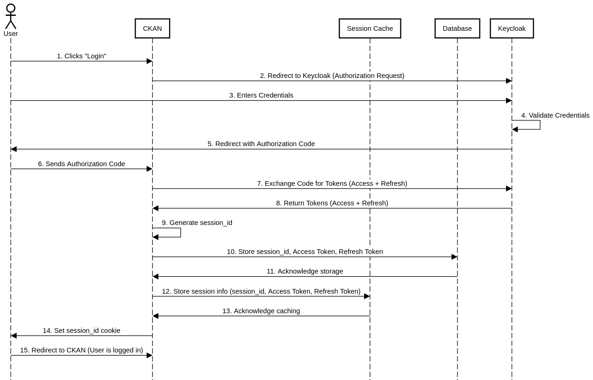
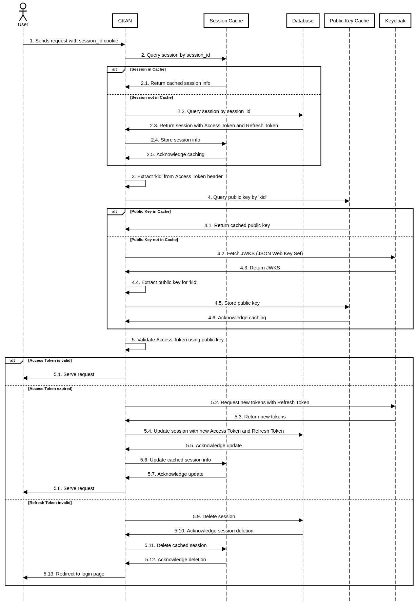
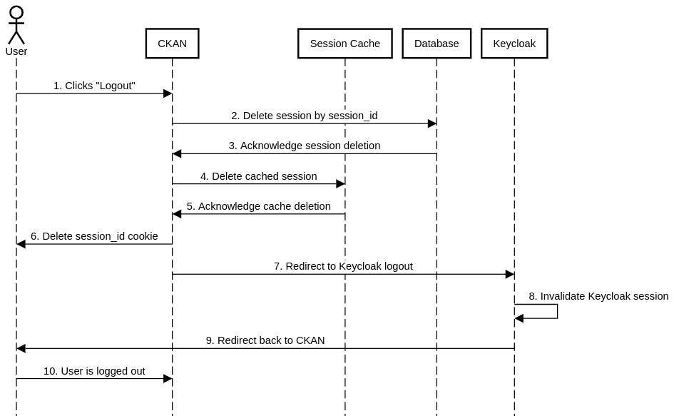

# ckanext-keycloak_auth

## Description
CKAN extension that enables Keycloak authentication and user management.

## Authentication Flow

### 1. **Login Flow**

The login process consists of a series of steps that take the user from unauthenticated to authenticated status within the system. This process leverages **OAuth2 with Keycloak as the identity provider**.

#### Login Flow Diagram:



#### Step-by-Step Login Flow:

1. **User Initiates Login**:
   - The user clicks the "Login" button at the top of the CKAN page.

2. **Redirection to Keycloak**:
   - CKAN constructs a URL pointing to the Keycloak authorization endpoint.
   - The URL includes `client_id`, `redirect_uri`, `response_type=code`, and `scope=openid`.
   - CKAN redirects the user to this Keycloak URL.

3. **Keycloak Authentication**:
   - The user is presented with Keycloak's login form.
   - The user enters their credentials (username and password) and submits the form.

4. **Credential Validation**:
   - Keycloak internally validates the user's credentials.

5. **Authorization Code Generation**:
   - Upon successful authentication, Keycloak generates an authorization code.
   - Keycloak redirects the user back to CKAN's specified `redirect_uri` with the authorization code.

6. **Authorization Code Received**:
   - The user's browser sends a request to CKAN with the authorization code.

7. **Token Exchange Request**:
   - CKAN sends a server-to-server POST request to Keycloak's token endpoint.
   - CKAN exchanges the authorization code for access and refresh tokens.

8. **Token Response**:
   - Keycloak responds to CKAN with the access and refresh tokens.

9. **Session ID Generation**:
   - CKAN generates a secure session ID for the user.

10. **Database Storage**:
    - CKAN stores the session ID, access token, and refresh token in its database.

11. **Storage Confirmation**:
    - The database acknowledges successful storage of the session information.

12. **Cache Storage**:
    - CKAN stores the session information (session ID, access token, refresh token) in the session cache.

13. **Cache Confirmation**:
    - The session cache acknowledges successful caching of the session information.

14. **Cookie Setting**:
    - CKAN sets a `session_id` cookie in the user's browser.

15. **Final Redirection**:
    - The user is redirected to the CKAN interface, now logged in and authenticated.

---

### 2. **Identify (User Verification) Flow**

Once the user is logged in, CKAN needs to verify their identity on each request to ensure the user is authorized to access the requested resources. This is handled by inspecting the session and validating the access token.

#### Identify Flow Diagram:



#### Step-by-Step Identity Verification Flow:

1. **User Sends a Request**:
   - The user navigates the CKAN site, making a request (e.g., visiting a dataset page).
   - The request includes the `session_id` cookie.

2. **Session Lookup**:
   - CKAN queries the session cache using the `session_id`.
   - If the session is in the cache:
     - 2.1. The cache returns the cached session information.
   - If the session is not in the cache:
     - 2.2. CKAN queries the database for the session information.
     - 2.3. The database returns the session with Access Token and Refresh Token.
     - 2.4. CKAN stores the session information in the cache.
     - 2.5. The cache acknowledges successful caching.

3. **Token Header Extraction**:
   - CKAN extracts the 'kid' (Key ID) from the Access Token header.

4. **Public Key Retrieval**:
   - CKAN queries the Public Key Cache using the 'kid'.
   - If the public key is in the cache:
     - 4.1. The cache returns the cached public key.
   - If the public key is not in the cache:
     - 4.2. CKAN fetches the JWKS (JSON Web Key Set) from Keycloak.
     - 4.3. Keycloak returns the JWKS.
     - 4.4. CKAN extracts the public key for the specific 'kid'.
     - 4.5. CKAN stores the public key in the cache.
     - 4.6. The cache acknowledges successful caching of the public key.

5. **Access Token Validation**:
   - CKAN validates the Access Token using the public key.
   - If the Access Token is valid:
     - 5.1. CKAN serves the user's request.
   - If the Access Token has expired:
     - 5.2. CKAN requests new tokens from Keycloak using the Refresh Token.
     - 5.3. Keycloak returns new Access and Refresh Tokens.
     - 5.4. CKAN updates the session in the database with the new tokens.
     - 5.5. The database acknowledges the update.
     - 5.6. CKAN updates the cached session information.
     - 5.7. The cache acknowledges the update.
     - 5.8. CKAN serves the user's request.
   - If the Refresh Token is invalid:
     - 5.9. CKAN deletes the session from the database.
     - 5.10. The database acknowledges the session deletion.
     - 5.11. CKAN deletes the cached session.
     - 5.12. The cache acknowledges the deletion.
     - 5.13. CKAN redirects the user to the login page.
---

### 3. **Logout Flow**

When a user logs out, the system must invalidate the session both in CKAN and in Keycloak, and ensure the user is no longer able to access protected resources.

#### Logout Flow Diagram:



#### Step-by-Step Logout Flow:

1. **User Initiates Logout**:
   - The user clicks the "Logout" button in the CKAN interface.

2. **Database Session Deletion**:
   - CKAN sends a request to delete the session from the database using the session_id.

3. **Database Acknowledgment**:
   - The database acknowledges the successful deletion of the session.

4. **Cache Session Deletion**:
   - CKAN delete the cached session from the Session Cache.

5. **Cache Acknowledgment**:
   - The Session Cache acknowledges the successful deletion of the cached session.

6. **Cookie Deletion**:
   - CKAN deletes the session_id cookie from the user's browser.

7. **Keycloak Logout Redirection**:
   - CKAN redirects the user to the Keycloak logout endpoint.

8. **Keycloak Session Invalidation**:
   - Keycloak invalidates its own session for the user.

9. **User Redirection to CKAN**:
   - Keycloak redirects the user back to CKAN (typically to the homepage or a logout confirmation page).

10. **Logout Completion**:
    - The user arrives at CKAN, now fully logged out.

---

### Summary

- **Login**: The user is redirected to Keycloak, authenticates, and returns to CKAN with tokens that are stored in a session. The session is maintained using a `session_id` cookie.
- **User Verification (Identify)**: On each request, CKAN verifies the user by checking the session, validating the access token, and potentially refreshing it if expired.
- **Logout**: The session is destroyed in CKAN, and the user is logged out from both CKAN and Keycloak. The session cookie is removed.


## Setup

1. Install <a href="https://docs.ckan.org/en/2.9/extensions/tutorial.html#installing-ckan" target="_blank">CKAN</a>

2. Start a Keycloak instance in Docker - <a href="https://www.keycloak.org/getting-started/getting-started-docker" target="_blank">Guide</a>

3. In Keycloak, create a realm with the <a href="https://github.com/ALTERNATIVE-EU/platform-deployment/blob/master/deployment/charts/keycloak/realms/alternative-realm.json" target="_blank">alternative realm json file</a>

4. From the Keycloak admin console, update the URLs of the `ai-ml-api`, `ckan-backend`, `ckan-frontend` and `jupyterhub` clients

5. Clone the repository in the `src` dir (usually located in `/usr/lib/ckan/default/src`)
    ```
    cd /usr/lib/ckan/default/src
    git clone https://github.com/ALTERNATIVE-EU/ckanext-keycloak_auth.git
    ```

6. Build the extension
    ```
    . /usr/lib/ckan/default/bin/activate
    cd /usr/lib/ckan/default/src/ckanext-keycloak_auth
    sudo python3 setup.py develop
    ```

7. Update the ckan config file (usually `/etc/ckan/default/ckan.ini`)
    - Add the extension to your list of plugins
    ```
    ckan.plugins = stats text_view recline_view keycloak_auth
    ```
    - Add <a href="https://github.com/ALTERNATIVE-EU/platform-deployment/blob/main/ckan-alternative-theme/keycloak_auth-config" target="_blank">these settings</a>; change the `ckan_url`, `server_url` and `client_secret_key` (generate new client credentials secret for `ckan-backend` client) params; you might need to change the URLs (Root URL, Valid Redirect URIs, Admin URL, Web Origins) of the `ckan-backend` and `ckan-frontend` clients in Keycloak

8. Add users in Keycloak; to make a sysadmin user - add them to the `admins` group

9. Start CKAN
   ```
   . /usr/lib/ckan/default/bin/activate
   sudo ckan -c /etc/ckan/default/ckan.ini run
   ```
